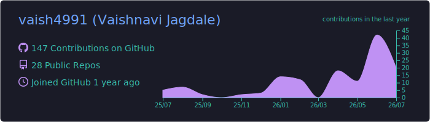
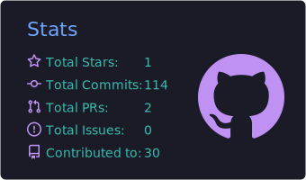
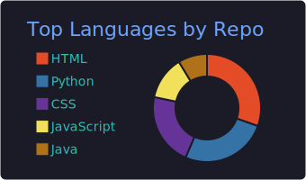

# Hi, I'm Vaishnavi Jagdale 👋

### Computer Engineering Undergraduate | AI/ML Enthusiast | Software Developer

I am a Computer Engineering undergraduate passionate about building practical software solutions and intelligent applications. I enjoy working with **Artificial Intelligence, Machine Learning, Backend Development, and Software Engineering**, while continuously strengthening my problem-solving and development skills.

Currently gaining hands-on experience through an **AI/ML Internship**, working on real-world projects involving AI systems, decision engines, multilingual applications, and intelligent agents.

---

## 👩‍💻 About Me

* 🎓 Pursuing **B.Tech in Computer Engineering**, graduating in **2028**
* 💼 Currently working as an **AI/ML Intern**
* 🤖 Interested in **Artificial Intelligence, Machine Learning, LLMs, and Software Development**
* 🌱 Currently strengthening my **Data Structures & Algorithms and AI/ML skills**
* 💡 Enjoy building practical applications and solving real-world problems
* 🤝 Open to collaborating on **AI/ML and Software Development projects**

---

## 🛠️ Technical Skills

**Programming Languages**

`Python` `Java` `C++` `C`

**Web Technologies**

`HTML` `CSS` `JavaScript`

**Databases**

`MySQL` `MongoDB`

**AI & Machine Learning**

`Machine Learning Fundamentals` `LLM Basics` `Prompt Engineering` `Chatbot Development`

**Core Computer Science**

`Data Structures & Algorithms` `Object-Oriented Programming` `DBMS` `SQL` `SDLC`

**Tools & Technologies**

`Git` `GitHub` `FastAPI` `Streamlit` `Google ADK`

---

## 🚀 Featured Projects

### 🤖 Emotion-Aware AI Companion

AI-based emotional support system designed to recognize user emotions and generate context-aware responses using NLP and intelligent conversational techniques.

### 🧭 ADK Day Trip Planning Agent

Intelligent AI agent developed using Google ADK to assist users in planning personalized day trips based on user requirements and preferences.

### 💰 Expense Tracker

Expense management application designed to help users record, organize, and monitor financial transactions efficiently.

### 🌱 Soil pH Detection Chatbot

AI-powered chatbot designed to provide soil pH insights and assist users with soil analysis and agriculture-related recommendations.

### 🧠 Decision Engine for AI Interview System

Rule-based decision engine built using Python and FastAPI to determine interview flow actions such as next questions, follow-ups, and interview completion based on evaluation scores and contextual signals.

### 🌐 Multi-Language Notification Template Engine

Python-based notification system supporting English, Hindi, and Telugu templates with locale-based template loading, placeholder validation, fallback handling, and automated testing.

---

## 📊 GitHub Activity

  

  
  

## 🏆 Achievements & Activities

- 🎓 Achieved **9.8 GPA in the Second Semester**
- 💻 Participated in multiple **Hackathons and Technical Competitions**
- 📢 Served as a **Campus Ambassador at IIT Bombay**
- 🧠 Built multiple projects across **AI/ML, Intelligent Agents, APIs, and Software Development**
- 🤝 Contributed to **Open-Source Projects through Issues and Pull Requests**
---

## 📫 Connect With Me

💼 **LinkedIn:** [www.linkedin.com/in/vaishnavi-jagdale-56417a31a](http://www.linkedin.com/in/vaishnavi-jagdale-56417a31a)

💻 **GitHub:** github.com/vaish4991

🌐 **Portfolio:** vaish4991.github.io/Personal_Portfolio/

---

### 💡 Developer Mindset

> Learning continuously, building consistently, and transforming ideas into impactful technology.

⭐ Feel free to explore my repositories and connect with me for collaboration, internships, and software development opportunities.
